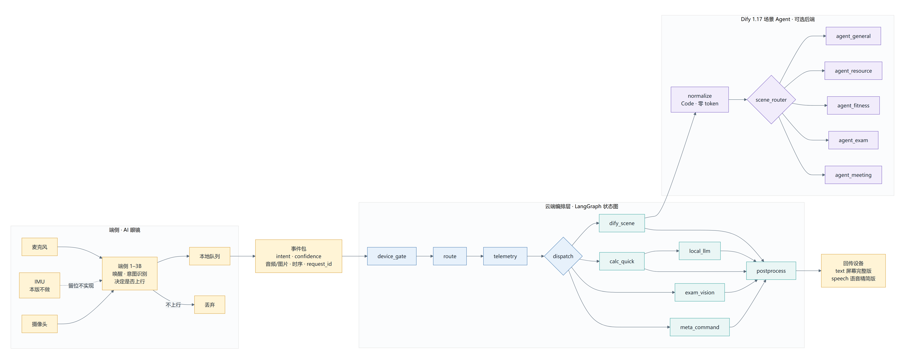

# AI 硬件智能助手

面向 **AI 智能眼镜**的多场景 AI 助手。端侧只有 1–3B 模型、输入只有麦克风 / IMU / 摄像头，
因此架构的核心问题是：**什么在端侧做、什么上云、断连了怎么办。**

本仓库包含三套可运行的实现与配套设计文档，**290 项测试全部不需要外部 API 即可通过**。

## 架构总览



- **端侧 1–3B**：只做唤醒、意图识别、决定是否上行。不做 VLM、不做长文生成、不做解题。
- **LangGraph 编排层**：权威路由（零 token 优先）、遥测、分发、后处理。
- **Dify 场景 Agent**：可选的场景执行后端。

> **路由不进 Dify**——一旦进去，端侧判对率就没有落点。

更多架构图见 [`docs/architecture/`](docs/architecture/)：状态机全图、请求生命周期、
端侧契约、模型分工。

## 三个项目的关系

| 目录 | 角色 | 测试 |
|---|---|---|
| [`assistant-lite/`](assistant-lite/) | 自研编排层（**基线**，保留作行为对照） | 189 |
| [`langgraph-app/`](langgraph-app/) | **LangGraph 状态图编排层** | 87 |
| [`dify-multiagent/`](dify-multiagent/) | Dify 1.17 五场景 Agent 执行层 | 14 |

```
端侧 1–3B ──事件包──▶ LangGraph 编排（权威路由）──▶ Dify 场景 Agent ──▶ 回传设备
   │                        │
   │                   checkpointer
   │                  断点续跑
   └─ 断连期间本地落盘，重连按原 request_id 补传（幂等）
```

## 关键设计

**断点续跑**（LangGraph 版本的核心收益）。基线用进程内线程池 + 内存表，重启即丢；
眼镜必然断连，所以状态必须落盘。实测在 `local_llm` 之前中断，
同一 `thread_id` 恢复后**只有未完成的那一步真正执行**：

```
中断时 routing = {'scene': 'general', 'action': 'answer'}
中断时 next    = ('local_llm',)
恢复后正文      = '恢复之后才生成的回答'      ← 模型调用计数 = 1
```

**端侧判定不具备权威性**。端侧判错会静默级联（喂错 Agent，用户拿到答非所问的结果），
而端侧永远不会知道自己错了。云端复核几乎免费（第 1–3 级是纯规则），
所以端侧负责门控、云端保留权威路由。实测：端侧把「膝盖疼」误判为 `exam`（置信度 0.95），
云端仍正确 reroute 到 `fitness` 并执行不适即停，**且判错这件事被记进了遥测**。

**能不用模型就不用**。算术走 AST 安全求值、图形推理走逐格运算校验、播报语走规则压缩、
路由规则命中时不调模型。由此才有「测试不依赖任何外部 API」这条硬约束。

**拍照解题真读图**。四步链：精读（只记录）→ 初解（**重看原图**）→ 工具校验（零 token）
→ 终审（**再重看原图**）。图形推理题一旦只靠文字转述，行列位置与黑白关系就没了。

## 快速开始

```powershell
# 编排层（主力项目）
cd langgraph-app
F:\python.exe -m pip install -r requirements.txt
Copy-Item .env.example .env      # 填入 DASHSCOPE_API_KEY（百炼）
.\start.ps1 -Check               # 自检：应看到「模型连通 : OK」
.\start.ps1                      # 起 Web 页（默认 8802）
```

> ⚠️ **本机的 `python` 命令是坏的**（PATH 里第一个是残缺 shim，报 `No pyvenv.cfg file`）。
> 用 `F:\python.exe`，或直接用会自动探测的 `start.ps1`。

```powershell
# 测试（全部不需要 API Key / 不联网）
cd langgraph-app;      F:\python.exe tests\test_graph.py    # 47 项
cd assistant-lite;     F:\python.exe tests\test_meeting.py  # 基线
cd dify-multiagent;    F:\python.exe tests\test_dsl_contract.py  # 14 项 Dify 契约
```

## 已知边界

如实记录，**不把这些当作已实现**：

| 项 | 状态 |
|---|---|
| 端侧 1–3B 模型 | **不在本仓库**，仅定义了契约（意图枚举 + 四态门控） |
| IMU | **未实现**。契约里留了位，但不写入、不伪造、不宣称 |
| 心率等生理指标 | **不做**——设备没有 PPG 传感器 |
| Dify Agent 节点 | 受 `agent_strategy_provider` 插件阻塞，现为 LLM 节点 + 场景提示词 |
| 流式 token 回传 | LangGraph 支持，**未接**设备播放链路 |
| 多租户与鉴权 | 未做（单机个人使用） |

## 文档

- [`docs/端侧适配设计_眼镜.md`](docs/端侧适配设计_眼镜.md) — 端云职责切分、意图契约、断连补传设计
- [`docs/architecture/`](docs/architecture/) — 六张架构图（由代码与数据库导出后渲染，可一键重跑）
- [`dify-multiagent/README.md`](dify-multiagent/README.md) — Dify 工作流、两个静默失败的坑
- [`langgraph-app/README.md`](langgraph-app/README.md) — 状态图设计、迁移中修掉的三个真 bug
