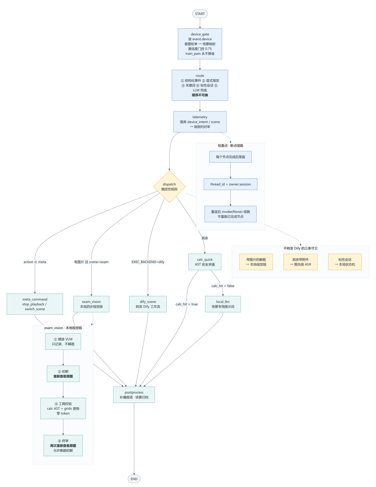
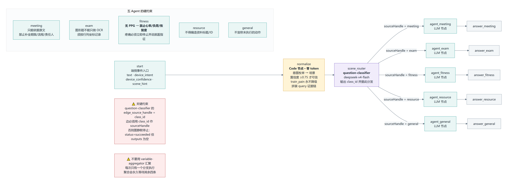
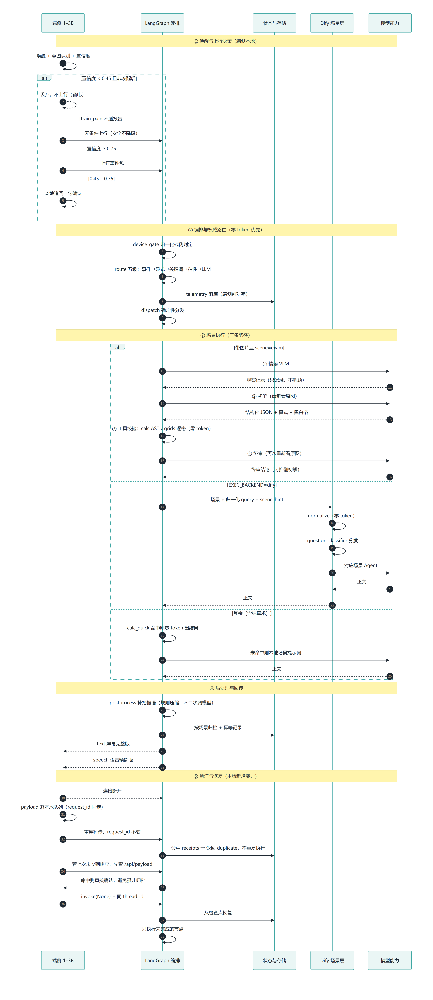
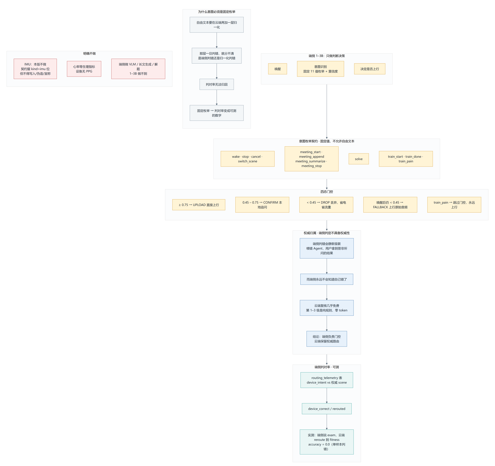
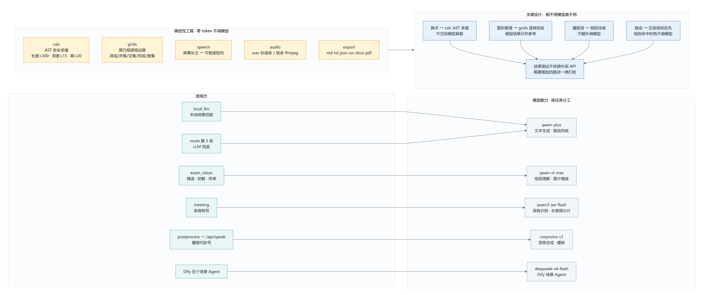

# Agent 架构图

> 全部由代码与数据库**导出后渲染**，不是手绘。
> 重新生成：`python export_facts.py && python render_mermaid.py`

## 目录

| 图 | 说明 |
|---|---|
| [01 系统总览](#01-系统总览) | 端侧 → LangGraph 编排 → Dify 场景层 → 回传 |
| [02 LangGraph 状态机](#02-langgraph-状态机) | 图节点、条件边、三条守卫、断点续跑 |
| [03 Dify 场景 Agent](#03-dify-场景-agent) | 五 Agent 分发与提示词硬约束 |
| [04 一次请求的完整生命周期](#04-一次请求的完整生命周期) | 含断连与恢复的时序 |
| [05 端侧契约与权威归属](#05-端侧契约与权威归属) | 意图枚举、四态门控、判对率 |
| [06 模型能力与确定性工具](#06-模型能力与确定性工具) | 哪个任务交给谁 |

---

## 01 系统总览


三层职责：

- **端侧 1–3B**：只做唤醒、意图识别、决定是否上行。不做 VLM、不做长文生成、不做解题。
- **LangGraph 编排层**：权威路由（零 token 优先）、遥测、分发、后处理。
- **Dify 场景 Agent**：可选的场景执行后端。**路由不进 Dify**——一旦进去，
  端侧判对率就没有落点。

`IMU` 画成虚线并标注「本版不做」：契约里留了 `kind=imu` 位，但**不写入、不伪造、不宣称**。

## 02 LangGraph 状态机



这张图是系统的心脏。三个值得注意的地方：

**路由顺序不可换**：事件 → 显式指定 → **关键词** → 粘性会话 → LLM 兜底。
关键词必须排在粘性之前，否则会议进行中一句「计算 (18+24)*3」会被当成会议内容吞掉。

**三条守卫从代码 if 变成了图上的条件边**（图中右侧方框）：

| 情况 | 去向 | 原因 |
|---|---|---|
| 带图片且 `scene=exam` | `exam_vision` | Dify 的 `start` 只收文本，转发会丢掉「终审重新看原图」 |
| 其余带附件 | `local_llm` | 需先做本地 ASR 预处理 |
| 粘性会话 | `local_llm` | 会议收集中/训练进行中是本地状态机 |

**`calc_quick` 之后的二选一读的是 `calc_hit`**，不是 `result.text`。
实测踩过坑：用 `result` 判断会读到检查点里**上一次**的值，
导致 `local_llm` 从不执行、用户拿到上一条请求的答案。

## 03 Dify 场景 Agent



**关键约束（图左下红框）**：`question-classifier` 的 `edge_source_handle = class_id`，
所以出边必须用 `class_id` 作 `sourceHandle`。接错的表现极具迷惑性——
分类器成功、日志无报错、`status=succeeded`，但 `outputs` 是空的
（图在分类器之后静默停止，`total_steps=3` 而不是 5）。

**不要用 `variable-aggregator` 汇聚五条分支**：每次请求只有一个分支执行，
聚合器会永久等待其余四条。

五 Agent 的提示词硬约束也画在图里，其中 fitness 那条最要紧：
**设备无 PPG，禁止心率/训练负荷/恢复度**这类需要生理数据的结论。

> ⚠️ 图中的「Agent」是 **LLM 节点 + 场景专用提示词**，不是 Dify 的 Agent 节点。
> Agent 节点需要 `agent_strategy_provider` 插件，本实例没装且市场不可用——
> 详见 `../../dify-multiagent/README.md`。**不要把 Agent 节点的语义当成已实现。**

## 04 一次请求的完整生命周期



五个阶段：① 唤醒与上行决策（端侧本地）② 编排与权威路由（零 token 优先）
③ 场景执行（三条路径）④ 后处理与回传 ⑤ 断连与恢复。

第 ⑤ 阶段是 LangGraph 版本**新增的能力**：`invoke(None)` + 同一 `thread_id`
从检查点恢复，只执行未完成的节点。基线的异步任务是进程内线程池 + 内存表，重启即丢。

补传路径上两道幂等保护：
- `receipts` 表命中 → 返回 `duplicate`，**不重复执行**（避免重复归档）
- 若上次没收到响应，先查 `/api/payload` 确认，**避免孤儿归档**

## 05 端侧契约与权威归属



三个结论：

**意图必须是固定 11 值枚举**，不允许自由文本。因为自由文本要在云端再加一层归一化，
那层一旦判错就分不清是端侧判错还是归一化判错——**判对率无法归因**。

**端侧判定不具备权威性**。端侧判错会静默级联（喂错 Agent，用户拿到答非所问的结果），
而端侧永远不会知道自己错了。云端复核几乎免费（第 1–3 级是纯规则），所以：
端侧负责门控，云端保留权威路由。

**四态门控**：`UPLOAD` / `CONFIRM` / `DROP` / `FALLBACK`，外加
`train_pain` 跳过门控永远上行（安全不降级）。

## 06 模型能力与确定性工具



分工原则：**能不用模型就不用**。

算术走 AST 安全求值、图形推理走逐格运算校验、播报语走规则压缩、路由规则命中时不调模型。
由此才有「测试不依赖任何外部 API」这条硬约束——需要模型的路径一律打桩。

---

## 文件说明

```
docs/architecture/
  export_facts.py            从代码导出真实图结构（LangGraph draw_mermaid + 节点表）
  render_mermaid.py          两遍渲染：先量内容尺寸，再按尺寸截图
  mermaid/*.mmd              图的唯一来源（可编辑）
  out/*.png                  渲染产物
  _facts.md                  导出的真实节点/边清单（人工核对用）
  vendor/mermaid.min.js      本地副本，离线可重复渲染
```

**为什么自己写渲染器**：`@mermaid-js/mermaid-cli` 要装 puppeteer + Chromium
（几百 MB，而本机已有 Chrome）。这里用 Python 生成 HTML，
让 headless Chrome 先 `--dump-dom` 量尺寸再 `--screenshot`，零额外依赖。

渲染注意：Chrome 输出路径**必须是纯英文**，中文路径下会静默不写文件（基线阶段踩过）。

## 已知的图与实现的偏差

如实列出，避免把图当成进度承诺：

| 图里的内容 | 实际状态 |
|---|---|
| 端侧 1–3B | **不在本仓库**，只定义了契约 |
| IMU | **未实现**（已画成虚线标注） |
| Dify「Agent」节点 | 实为 LLM 节点 + 提示词；Agent 节点受插件阻塞 |
| 模型 `deepseek-v4-flash` | 火山方舟欠费后从 `doubao` 切换过来的 |
| 流式 token 回传 | LangGraph 支持，**未接**设备播放链路 |
