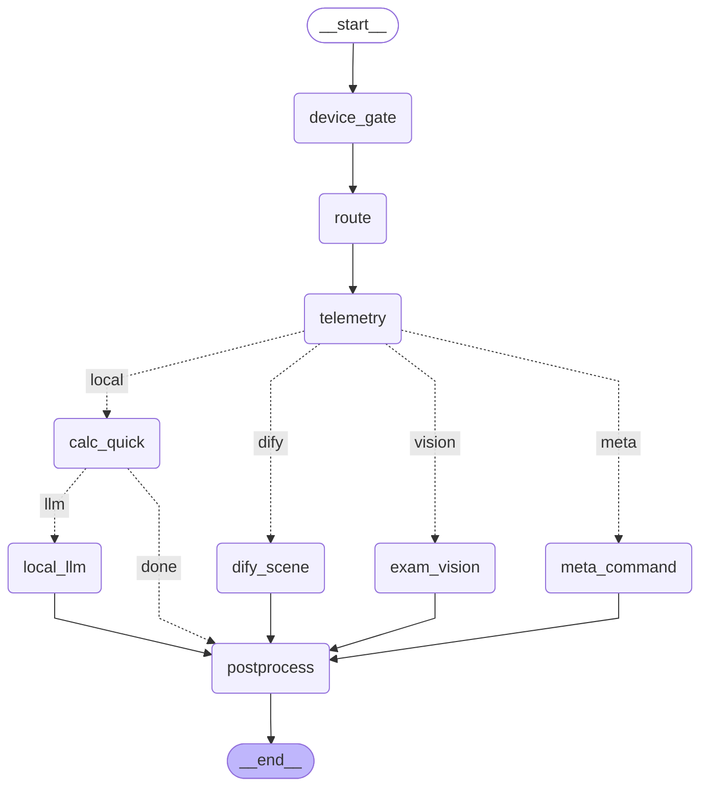

## LangGraph 图（draw_mermaid 原始输出）

## LangGraph 节点

- `calc_quick`
- `device_gate`
- `dify_scene`
- `exam_vision`
- `local_llm`
- `meta_command`
- `postprocess`
- `route`
- `telemetry`

## LangGraph 条件边（dispatch 的可能去向）

- `meta`   → meta_command
- `vision` → exam_vision（带图片且场景=exam）
- `dify`   → dify_scene（EXEC_BACKEND=dify）
- `local`  → calc_quick

## calc_quick 之后的二选一

- `done` → postprocess（命中纯算术，零 token）
- `llm`  → local_llm
